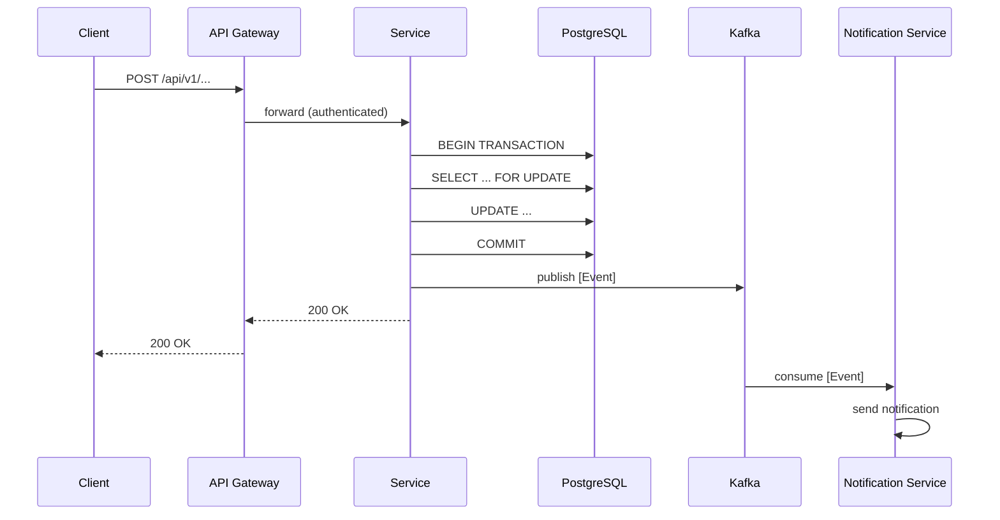
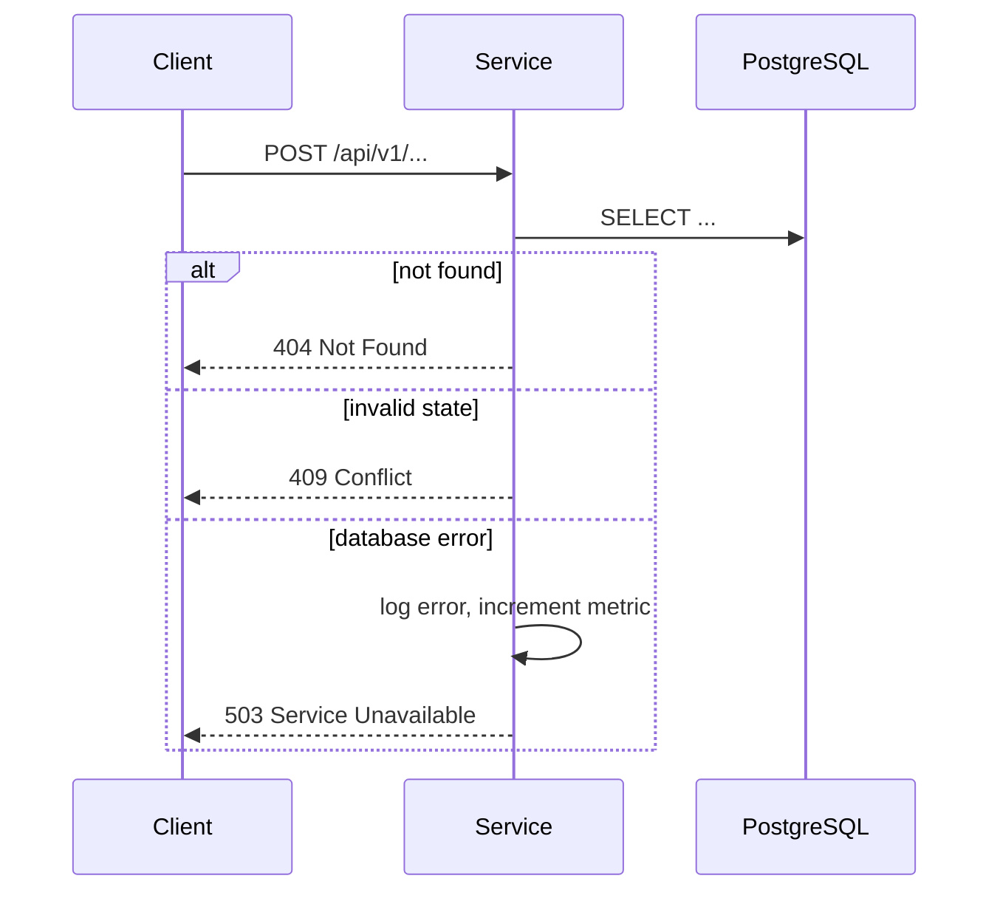
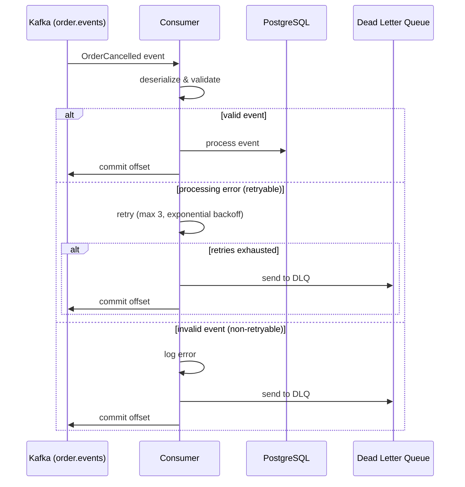

# Deep Dive Template

Use this template for **Deep Dive** depth. Target: 6-12+ pages. Comprehensive specification for complex, high-risk, or cross-service features. Includes everything from Standard plus sequence diagrams, detailed error flows, capacity planning, and rollout strategy.

---

```markdown
# Tech Spec: [Feature Name] — Deep Dive

**Date:** [date]
**Depth:** Deep Dive
**Status:** Draft
**PRD:** [link or filename]
**Event Catalog:** [link or "N/A"]
**Related Specs:** [links to related tech specs]
**Reviewers:** [who should review this]

---

## 1. Context & Goals

### Problem Statement
[Detailed description of the problem. Include data or evidence if available — support volume, error rates, customer feedback.]

### Goals
1. [Measurable goal with success criteria]
2. [Measurable goal with success criteria]
3. [Measurable goal with success criteria]

### Non-Goals
- [Out of scope 1 — explain why]
- [Out of scope 2 — explain why]

### Background
[Thorough context. Existing system behavior, prior decisions and ADRs, related features, previous attempts, dependencies on other teams.]

### Stakeholders
| Role | Team/Person | Interest |
|------|------------|----------|
| [Product] | [who] | [what they care about] |
| [Engineering] | [who] | [what they care about] |
| [Dependent team] | [who] | [cross-service impact] |

---

## 2. Architecture Approach

### High-Level Design

[Where does this feature live? Which module/service/bounded context?]

```
[Detailed component diagram — ASCII art]
```

### Design Decisions

**Decision 1: [Short title]**
- **Chosen:** [What]
- **Alternatives considered:**
  - [Alternative A] — rejected because [reason]
  - [Alternative B] — rejected because [reason]
- **Rationale:** [Detailed reasoning]
- **Trade-offs:** [What we give up, and why that's acceptable]
- **Reversibility:** [Easy/medium/hard to change later]

**Decision 2: [Short title]**
[repeat structure]

### Module/Package Placement

```
com.example.{service}/
├── domain/model/        → [what goes here, with file list]
├── domain/event/        → [what goes here]
├── domain/repository/   → [ports]
├── application/command/  → [command handlers]
├── application/query/    → [query handlers]
├── infrastructure/persistence/ → [JPA adapters]
├── infrastructure/messaging/   → [Kafka adapters]
├── infrastructure/client/      → [external API clients]
└── api/controller/       → [REST controllers]
```

### Cross-Service Impact
[Which other services are affected? What changes do they need?]

| Service | Impact | Action Required |
|---------|--------|----------------|
| [Service A] | [Description] | [What they need to do] |
| [Service B] | [Description] | [What they need to do] |

---

## 3. API Design

### [Endpoint 1]: [HTTP Method] [Path]

**Purpose:** [What this endpoint does]

**Request:**
```json
{
  "field1": "type — description — constraints",
  "field2": "type — description — constraints (optional, default: X)"
}
```

**Response (200):**
```json
{
  "field1": "type — description",
  "field2": "type — description"
}
```

**Error Responses:**

| Status | Code | Message | When | Client Action |
|--------|------|---------|------|---------------|
| 400 | `INVALID_REQUEST` | `{details}` | [Condition] | Fix input and retry |
| 404 | `NOT_FOUND` | `{entity} not found` | [Condition] | Check ID |
| 409 | `CONFLICT` | `{reason}` | [Condition] | Check state, may retry |
| 429 | `RATE_LIMITED` | `Retry after {N}s` | [Condition] | Backoff and retry |
| 503 | `SERVICE_UNAVAILABLE` | `{dependency} down` | [Condition] | Retry with backoff |

**Validation Rules:**
- `field1`: required, non-blank, max 200 chars, alphanumeric + hyphens
- `field2`: optional, ISO 8601 format, must be in the future

**Idempotency:** [Detailed strategy — e.g., idempotency key in header, dedup window]

**Rate Limiting:** [Limits per client/user, burst allowance]

### [Endpoint 2]: [HTTP Method] [Path]
[repeat structure]

---

## 4. Sequence Diagrams

### Happy Path: [Flow Name]



### Error Flow: [Scenario Name]



### Async Flow: [Event Processing]



---

## 5. Data Model

### [Entity Name]

| Field | Type | Constraints | Default | Notes |
|-------|------|-------------|---------|-------|
| id | UUID | PK | gen_random_uuid() | |
| [field] | [type] | [constraints] | [default] | [notes] |
| version | INTEGER | NOT NULL | 0 | Optimistic locking |
| created_at | TIMESTAMPTZ | NOT NULL | now() | |
| updated_at | TIMESTAMPTZ | NOT NULL | now() | Auto-updated by trigger or JPA |

**Indexes:**
- `idx_{table}_{field}` on `{field}` — used by [query], expected cardinality: [N]
- `idx_{table}_{field1}_{field2}` on `({field1}, {field2})` — composite for [query]

**Constraints:**
- `chk_{table}_{field}` CHECK ([condition]) — enforces [business rule]
- `uq_{table}_{fields}` UNIQUE ([fields]) — prevents [duplicate scenario]

**State Machine:**
```
          ┌─────────┐
    ┌────▶│ STATE_A  │─────┐
    │     └────┬────┘     │
    │          │ [action]  │ [action]
    │          ▼           ▼
    │     ┌─────────┐  ┌─────────┐
    │     │ STATE_B  │  │ STATE_C │ (terminal)
    │     └────┬────┘  └─────────┘
    │          │ [action]
    │          ▼
    │     ┌─────────┐
    └─────│ STATE_D │ (terminal)
          └─────────┘

Transitions:
- STATE_A → STATE_B: [trigger, who can do it, preconditions]
- STATE_A → STATE_C: [trigger, who can do it, preconditions]
- STATE_B → STATE_D: [trigger, who can do it, preconditions]
```

**Optimistic Locking:** Use `@Version` on the `version` field to prevent concurrent modification.

### Entity Relationships

```
[Entity A] 1──────N [Entity B]
               │
[Entity A] 1──────1 [Entity C]
```

### Migration

```sql
-- V{NNN}__{description}.sql

BEGIN;

CREATE TABLE [table] (
    [full column definitions]
);

CREATE INDEX CONCURRENTLY [index] ON [table]([columns]);

-- Backfill existing data (if applicable)
UPDATE [existing_table] SET [field] = [value] WHERE [condition];

COMMIT;
```

**Rollback Script:**
```sql
-- R{NNN}__{description}.sql (keep alongside migration, do not run automatically)
DROP INDEX IF EXISTS [index];
DROP TABLE IF EXISTS [table];
```

### Data Growth Projections

| Table | Current Rows | Growth Rate | 6-Month Projection | 1-Year Projection |
|-------|-------------|-------------|-------------------|-------------------|
| [table] | [N] | [X/day] | [N] | [N] |

---

## 6. Integration Points

### [Integration Name]

**Type:** Sync API | Kafka event | Async job
**Direction:** Outbound | Inbound
**Target:** [Service name]
**SLA:** [Expected availability, latency]

**Contract:**
```json
{
  "eventType": "[EventName]",
  "version": "1.0",
  "field1": "type — description",
  "field2": "type — description"
}
```

**Schema Evolution:** [Forward/backward compatible changes only. New fields optional with defaults.]

**Failure Handling:**
| Failure Mode | Detection | Response | Recovery |
|-------------|-----------|----------|----------|
| Timeout | >[X]ms | Return 503, increment metric | Auto-retry [N] times |
| 5xx from dependency | HTTP status | Circuit breaker opens | Half-open test after [N]s |
| Invalid response | Schema validation | Log + alert, return 503 | Manual investigation |
| Kafka publish failure | Exception on send | Retry [N] times | DLQ after exhaustion |

**Circuit Breaker Configuration:**
- Failure threshold: [N] failures in [T] seconds
- Open state duration: [N] seconds
- Half-open: allow [N] test requests

### Domain Events Published

| Event | Topic | Partition Key | Schema Version | When |
|-------|-------|--------------|----------------|------|
| [Event] | [topic] | [key] | v1 | [trigger] |

**Ordering Guarantee:** Events for the same [partition key] are ordered. Cross-key ordering is not guaranteed.

**Delivery Guarantee:** At-least-once. Consumers must be idempotent.

---

## 7. Non-Functional Requirements

### Performance

| Metric | Target | Current Baseline | Measurement Method |
|--------|--------|-----------------|-------------------|
| p50 latency | [X]ms | [Y]ms | [endpoint], Datadog APM |
| p99 latency | [X]ms | [Y]ms | [endpoint], Datadog APM |
| Throughput | [X] RPS | [Y] RPS | [endpoint], load test |
| DB query time | [X]ms | [Y]ms | [query], slow query log |

**Load Test Plan:**
- Tool: [k6 / Gatling / JMeter]
- Scenarios: [describe load patterns]
- Success criteria: [all p99 < target, 0 errors, no circuit breakers tripped]

### Security
- **Authentication:** [Method — JWT, session, API key]
- **Authorization:** [RBAC roles and permissions for each endpoint]
- **Input validation:** [Detailed approach — whitelist, sanitize, parameterized queries]
- **Data sensitivity:** [PII fields identified, encryption at rest, masking in logs]
- **Audit logging:** [Which operations are logged, retention period]

### Caching
- **Strategy:** [Detailed — which layer, which data, consistency model]
- **TTL:** [per cache key pattern]
- **Invalidation:** [event-driven, time-based, or manual]
- **Cache warming:** [strategy for cold start, if applicable]
- **Cache miss behavior:** [fallback to DB, with or without backfill]

### Capacity Planning

| Resource | Current | After Feature | 6-Month | Action Needed? |
|----------|---------|---------------|---------|---------------|
| Database storage | [X] GB | [Y] GB | [Z] GB | [Yes/No — scale plan] |
| Database connections | [X] | [Y] | [Z] | [pool size change?] |
| Kafka partitions | [X] | [Y] | [Z] | [repartition needed?] |
| Memory per pod | [X] MB | [Y] MB | [Z] MB | [resource limit change?] |

---

## 8. Observability (for manual setup)

### Key Metrics to Instrument
| Metric | Type | Labels | Purpose |
|--------|------|--------|---------|
| `order.cancel.count` | Counter | status, reason | Track cancellation volume |
| `order.cancel.duration` | Timer | — | Track handler latency |
| `order.cancel.error` | Counter | error_type | Track failure types |

### Important Log Events
| Event | Level | Fields | Purpose |
|-------|-------|--------|---------|
| Order cancelled | INFO | orderId, reason, userId | Audit trail |
| Cancellation failed | WARN | orderId, error, userId | Debugging |
| Circuit breaker opened | ERROR | service, failureCount | Ops alerting |

### Recommended Alerts
| Alert | Condition | Severity | Action |
|-------|-----------|----------|--------|
| High cancel error rate | >5% errors in 5min | P2 | Investigate logs |
| Cancel latency spike | p99 > [X]ms for 10min | P3 | Check DB, dependencies |
| Circuit breaker open | breaker.state = open | P1 | Check dependency health |

### Datadog Dashboard Panels
1. Cancellation rate (req/min) over time
2. Latency percentiles (p50, p95, p99)
3. Error rate by type
4. Downstream dependency health

---

## 9. Rollout Strategy

### Phase 1: Feature Flag (Day 0)
- Deploy behind feature flag `feature.order-cancellation`
- Flag off by default
- Enable for internal users / staging only

### Phase 2: Canary (Day 1-3)
- Enable for [X]% of traffic
- Monitor error rate, latency, cancellation volume
- Rollback trigger: error rate > [X]% or p99 > [Y]ms

### Phase 3: Gradual Rollout (Day 3-7)
- Increase to [25% → 50% → 100%] over [N] days
- Monitoring at each stage

### Phase 4: Cleanup (Day 14+)
- Remove feature flag
- Remove old code paths
- Update documentation

### Rollback Plan
1. Disable feature flag (immediate, <1 min)
2. If DB migration deployed: [is it backward compatible? Can old code run against new schema?]
3. If Kafka events published: [consumers must handle both old and new event shapes]

---

## 10. Open Questions & Risks

### Open Questions
| # | Question | Impact | Blocking? | Owner | Deadline |
|---|----------|--------|-----------|-------|----------|
| Q1 | [question] | [design impact] | Yes/No | [who] | [when] |

### Risks
| # | Risk | Likelihood | Impact | Mitigation | Contingency |
|---|------|-----------|--------|------------|-------------|
| R1 | [risk] | Low/Med/High | Low/Med/High | [prevention] | [if it happens] |

---

## Glossary

| Term | Definition |
|------|-----------|
| [term] | [definition in context of this feature] |

## References
- [PRD link]
- [Event catalog link]
- [Related ADRs]
- [Existing tech specs for related features]
- [External documentation (API docs, library docs)]
```